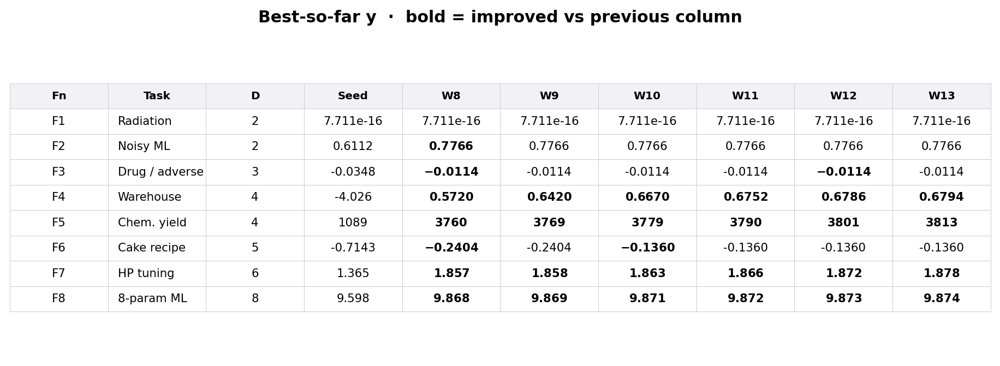

# Bayesian Black-Box Optimisation — Final research report

**Imperial College London · PCMLAI Stage 2 capstone**  
**Author:** Erkan Keskin · **Organisation:** Neuroxa-Labs  
**Repository:** https://github.com/Neuroxa-Labs/Bayesian_Optimisation  

| Field | Value |
|-------|--------|
| **Status** | Weeks 1–13 complete · final round **4/8 improved** (F4, F5, F7, F8) |
| **Primary method** | Gaussian Process (Matérn + ARD) · EI / UCB · trust-region exploit |
| **Report version** | v2 (post–Week-13 results) |

This document is the portfolio **evidence pack**: overall results, method, per-function findings, and final-round queries. Supporting artefacts live in the repository (datasheet, model card, weekly notes, figures).

---

## 1. Objective

Maximise eight unknown continuous black-box functions \(f_i : [0,1]^{d_i} \rightarrow \mathbb{R}\) under a strict budget of **one query per function per week**. The true formulas are withheld; only portal evaluations \((x, y)\) are observed. Higher \(y\) is always better.

The goal is **not** to recover the formula. The goal is to find high-performing \(x\) values with sample-efficient sequential decisions.

---

## 2. Overall summary (after Week 13)

| Fn | Task | \(d\) | Obs. | Final best \(y\) | Incumbent \(x\) (6 d.p.) | Status |
|----|------|------:|-----:|------------------|---------------------------|--------|
| F1 | Radiation | 2 | 23 | **7.711×10⁻¹⁶** | 0.731024-0.733000 | Unresolved; late lobe to −0.00457 |
| F2 | Noisy ML | 2 | 23 | **0.776645** | 0.717869-0.020000 | Strong sharp ridge (W13 miss) |
| F3 | Drug / adverse | 3 | 27 | **−0.011366** | 0.492581-0.691593-0.401000 | Safe band held through W13 |
| F4 | Warehouse | 4 | 43 | **0.679389** | 0.405000-0.412000-0.354000-0.414000 | Strong late climb (W13) |
| F5 | Chem. yield | 4 | 33 | **3812.75** | 0.450000-0.980000-0.980000-0.980000 | Ridge optimum (W13) |
| F6 | Cake recipe | 5 | 33 | **−0.136** | 0.441000-0.249000-0.591000-0.729000-0.131000 | W10 basin (W13 short) |
| F7 | HP tuning | 6 | 43 | **1.877841** | 0.074000-0.424000-0.299000-0.158000-0.346000-0.672000 | Strong late climb (W13) |
| F8 | 8-param ML | 8 | 53 | **9.873669** | 0.144000-0.060000-0.210000-0.050000-0.414000-0.510000-0.216000-0.917000 | Strong late climb (W13) |

**Late improve counts:** W8 3/8 · W9 4/8 · W10 **5/8** · W11 4/8 · W12 4/8 · W13 4/8 (F4, F5, F7, F8).

### Compact incumbent table (Seed → late weeks)



### Best-so-far curves


---

## 3. Method

### 3.1 Core loop

1. Load per-function history from `data/function_*/initial_*.npy`.
2. Fit a **Matérn GP** with **ARD** length scales (multi-restart LML).
3. Score candidates with **EI** or **UCB**; search globally and inside a **trust region** around the incumbent.
4. Apply per-function constraints (locks, boundary penalty, anti-duplicate, F1 trust gate).
5. Submit a six-decimal portal string; append \(y\); repeat.

Executable code: [`notebooks/BBO_Capstone_Optimized.ipynb`](../notebooks/BBO_Capstone_Optimized.ipynb).  
Transparency: [`DATASHEET.md`](../DATASHEET.md) · [`MODEL_CARD.md`](../MODEL_CARD.md).  
Technical rationale: [`TECHNICAL_JUSTIFICATION.md`](TECHNICAL_JUSTIFICATION.md).

### 3.2 Per-function specialisations

| Fn | Adaptation |
|----|------------|
| F1 | Trust gate: refuse GP exploit while labels are ~null; exploit only after a real signal cluster |
| F2 | WhiteKernel noise model; hard-return to sharp ridge after misses |
| F3 | Safe \(x_3\) lock near the −0.011 neighbourhood |
| F4 / F7 / F8 | Shrinking trust-region micro-steps on ARD-sensitive axes |
| F5 | Log-\(y\) GP fit; lock high \(x_2\)–\(x_4\) face; climb \(x_1\) |
| F6 | Hard-return to Week-10 cake centroid after failed neighbour steps |

### 3.3 What we deliberately did *not* do

Neural nets / large ensembles were **not** the primary weekly decider. With \(n \approx 20\)–50 points, calibrated uncertainty matters more than flexible curve-fitting. Peer pipelines that emphasise NN/Optuna/TuRBO as *diagnostics* are compatible with this view; replacing the GP as the sole portal decider on this budget was not justified for our evidence.

---

## 4. Winning-query evidence (incumbents after Week 13)

First week in which the **current** incumbent \(y\) was achieved (approximate attribution from weekly logs).

| Fn | Best \(y\) | Approx. winning phase | Attribution |
|----|------------|----------------------|-------------|
| F1 | 7.711×10⁻¹⁶ | Seed | Seed design (late lobe still below seed max) |
| F2 | 0.776645 | Week 5 | GP / EI on noisy ridge |
| F3 | −0.011366 | Week 6 | Local exploit + \(x_3\) discipline |
| F4 | 0.679389 | Week 13 | Trust-region micro-step |
| F5 | 3812.75 | Week 13 | Ridge climb (\(x_1\)=0.45) |
| F6 | −0.136 | Week 10 | Local basin hit |
| F7 | 1.877841 | Week 13 | Trust-region micro-step |
| F8 | 9.873669 | Week 13 | Trust-region micro-step |

**Takeaway.** Different functions rewarded different regimes: early ridge discovery (F2/F5 path), mid-project locks (F3), and late compressed exploit (F4/F7/F8). F1 remains a sparse-detection problem; F6 shows that leaving a sharp basin without evidence is expensive.

---

## 5. Per-function findings

### F1 — Radiation source (2D)

**Story.** Locate a hidden source; most of the map reads ~0.  
**Incumbent.** \(y = 7.711\times10^{-16}\) at `[0.731024, 0.733000]` (seed).  
**Late evidence.** Weeks 10–12 opened a measurable lobe near `(0.64, 0.68)` with readings −0.00807 → −0.00623 → −0.00512 → −0.00457 (Week 13; still below seed max).  
**Status.** Unresolved absolute peak; lobe improved through the final round.  
**Figure:** `data/function_1/analysis_F1.png`

### F2 — Noisy ML score (2D)

**Story.** Two settings; noisy log-likelihood.  
**Incumbent.** \(y = 0.776645\) at `[0.717869, 0.020000]`.  
**Lesson.** Sharp ridge: “nearby” steps often land ~0.54 → hard-return policy.  
**Figure:** `data/function_2/analysis_F2.png`

### F3 — Drug / adverse (3D)

**Story.** Three mixture ratios; nearer zero is safer.  
**Incumbent.** \(y = -0.011366\) at `[0.492581, 0.691593, 0.401000]`.  
**Lesson.** \(x_3\) is sensitive; lock the safe band. Week 13 reaffirmed the −0.011 peak.  
**Figure:** `data/function_3/analysis_F3.png`

### F4 — Warehouse (4D)

**Story.** Multimodal efficiency landscape.  
**Incumbent.** \(y = 0.679389\) (Week 13).  
**Lesson.** After a basin is proven, micro-steps beat global jumps.  
**Figure:** `data/function_4/analysis_F4.png`

### F5 — Chemical yield (4D)

**Story.** Maximise yield on a ridge.  
**Incumbent.** \(y = 3812.75\) at `[0.45, 0.98, 0.98, 0.98]`.  
**Lesson.** Clearest success: lock high face, climb \(x_1\) (seed ~1089 → ~3813).  
**Figure:** `data/function_5/analysis_F5.png`

### F6 — Cake recipe (5D)

**Story.** Five ingredients; nearer zero is better.  
**Incumbent.** \(y = -0.136\) (Week 10).  
**Lesson.** Week 11 collapse after a small off-centroid step → hard-return rule.  
**Figure:** `data/function_6/analysis_F6.png`

### F7 — Hyperparameter tuning (6D)

**Story.** Six training knobs.  
**Incumbent.** \(y = 1.877841\) (Week 13).  
**Lesson.** Move ARD-sensitive axes only; accept slow compound gains.  
**Figure:** `data/function_7/analysis_F7.png`

### F8 — Eight-parameter ML (8D)

**Story.** Highest dimension; sparse coverage.  
**Incumbent.** \(y = 9.873669\) (Week 13).  
**Lesson.** Trust-region ticks + boundary penalty; do not chase edge σ artefacts.  
**Figure:** `data/function_8/analysis_F8.png`

### Cluster view (Week 12)


---

## 6. Week 13 / final round (complete)

Near-pure exploitation and recoveries. Full rationale: [`weeks/WEEK13_STRATEGY.md`](../weeks/WEEK13_STRATEGY.md).  
RL framing: [`weeks/final_round_rl_reflection.md`](../weeks/final_round_rl_reflection.md).

```
Function 1:  0.635000-0.688000
Function 2:  0.717870-0.020000
Function 3:  0.492580-0.691590-0.401000
Function 4:  0.405000-0.412000-0.354000-0.414000
Function 5:  0.450000-0.980000-0.980000-0.980000
Function 6:  0.441200-0.249200-0.590800-0.728700-0.131200
Function 7:  0.074000-0.424000-0.299000-0.158000-0.346000-0.672000
Function 8:  0.144000-0.060000-0.210000-0.050000-0.414000-0.510000-0.216000-0.917000
```

| Fn | Mode |
|----|------|
| F1 | Signal-lobe micro-step |
| F2 / F3 / F6 | Hard return toward historical best |
| F4 / F7 / F8 | Micro from Week-12 incumbents |
| F5 | Ridge continue \(x_1=0.45\) |

**Portal \(y\) for Week 13:** recorded — **4/8 improved** (F4, F5, F7, F8). Full write-up: [`weeks/WEEK13_REFLECTION.md`](../weeks/WEEK13_REFLECTION.md).

---

## 7. Limitations

- One query per function per week — no inner real-function line search.
- GP can be confidently wrong in empty regions (inflated σ → boundary chase).
- Clustered sampling can miss a distant second mode.
- F1 absolute best remains a near-null seed reading despite a late measurable lobe.
- F2 observed best may be an optimistic draw under noise.
- F3 still has a mid-project weekly gap in `data/`; Week 13 was appended without fabricating missing rows.

---

## 8. Related artefacts

| Artefact | Path |
|----------|------|
| Strategy hub (parameters + policies) | [`../STRATEGY.md`](../STRATEGY.md) |
| Approach presentation text | [`approach_presentation.md`](approach_presentation.md) |
| This report as PDF | [`final_report.pdf`](final_report.pdf) |
| Project FAQ (PDF) | [`project_faq.pdf`](project_faq.pdf) |
| Project reflection | [`../weeks/project_reflection.md`](../weeks/project_reflection.md) |
| Successful strategies (+ Matt peer) | [`../weeks/successful_strategies_reflection.md`](../weeks/successful_strategies_reflection.md) |
| Visual gallery | [`../reports/analysis/README.md`](../reports/analysis/README.md) |
| Progress dashboard | [`../reports/progress/README.md`](../reports/progress/README.md) |
| Course file map | [`COURSE_INDEX.md`](COURSE_INDEX.md) |

---

## 9. Conclusion

Under a one-query-per-week budget, a **single interpretable GP per function**, specialised with ARD, locks, trust regions and an F1 trust gate, produced clear late gains on F4/F5/F7/F8, a strong ridge on F2, a safe band on F3, and a fragile but real basin on F6. F1 remains the hardest sparse-signal case. Week 13 commits to near-pure exploitation of those validated regions. Week 13 confirmed that trust-region / ridge exploit continued to pay on F4/F5/F7/F8, while sharp basins (F2/F6) and sparse F1 remained hard.
