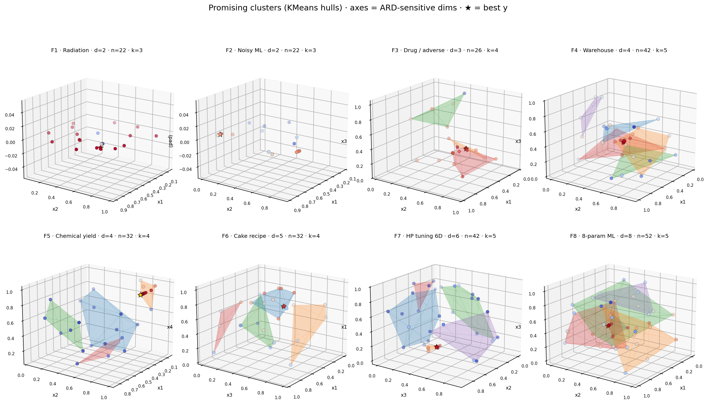
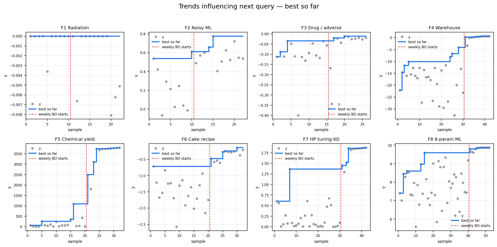
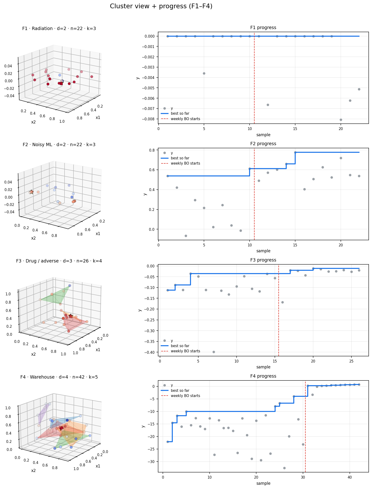
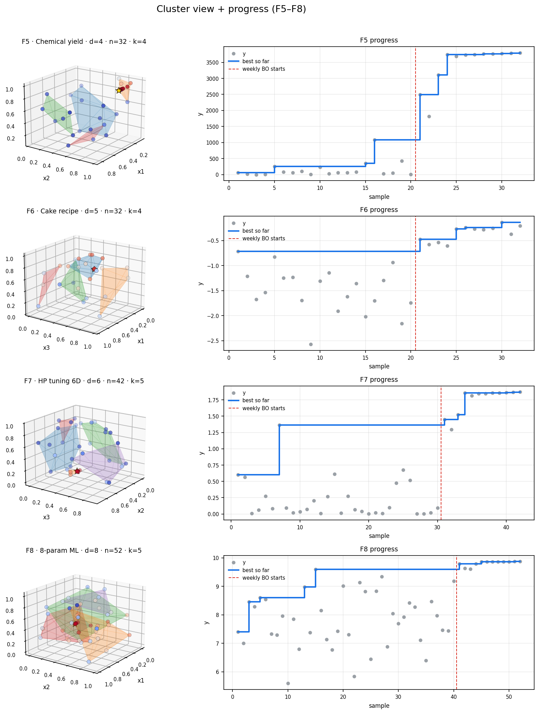
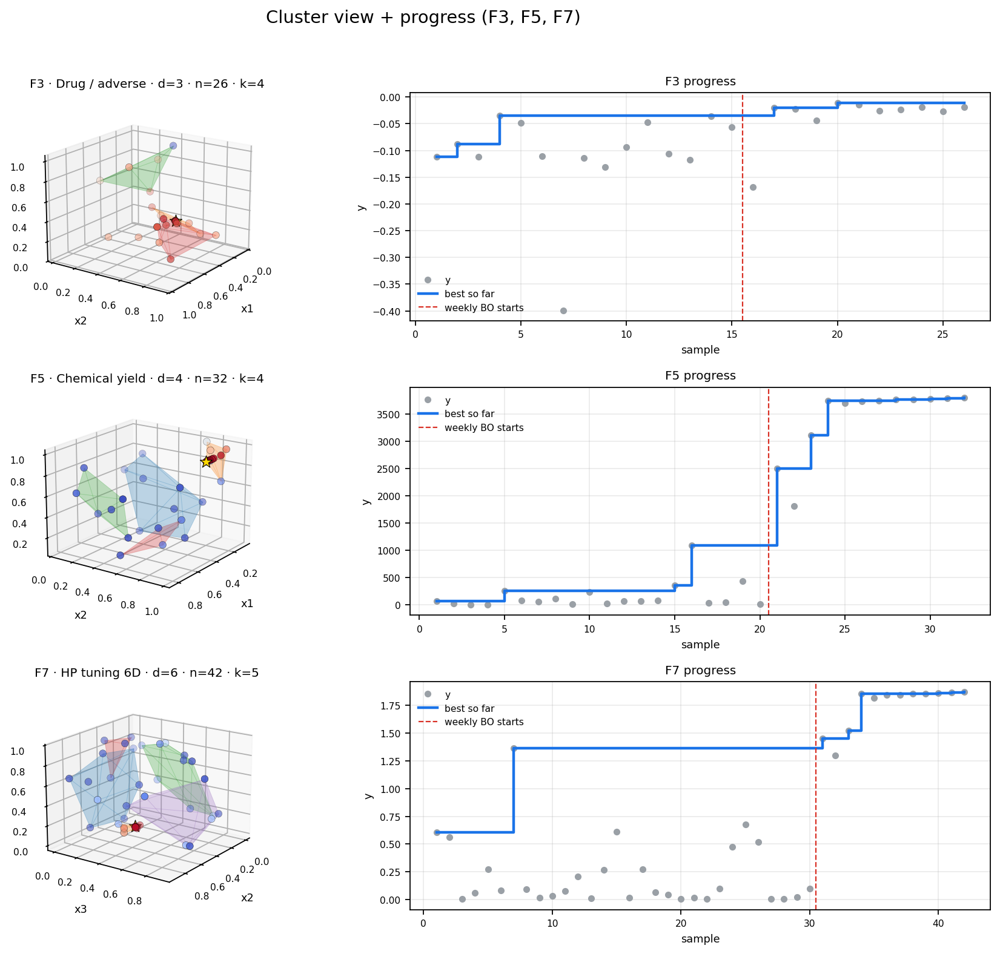

# Cluster & progress gallery

Visual diagnostics for the eight black-box functions after **Week 12**.  
Axes are ARD-sensitive dimensions from a Matérn GP; gold ★ marks the incumbent.

Regenerate: `python scripts/make_cluster_gallery.py`

| File | What it shows |
|------|----------------|
| `cluster_gallery_3d.png` | 3D cluster hulls, F1–F8 |
| `progress_best_so_far.png` | Best-y step charts |
| `cluster_progress_pairs_1.png` | Hull + progress, F1–F4 |
| `cluster_progress_pairs_2.png` | Hull + progress, F5–F8 |
| `cluster_progress_pairs.png` | Highlight pair set (F3, F5, F7) |

## 3D promising clusters (F1–F8)

## Best-so-far trends

## Cluster + progress pairs

### F1–F4

### F5–F8

### Highlight (F3, F5, F7)

> **GitHub tip:** This Markdown page is the gallery that renders online. HTML files (including [`cluster_gallery.html`](cluster_gallery.html)) do not execute in GitHub’s code browser — open them locally if needed.  
> Early per-week snapshots (weeks 2–6) live under [`archive/`](archive/).
